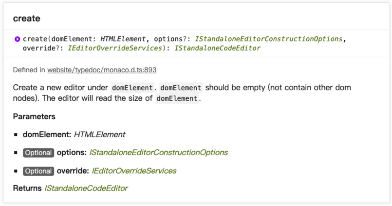

## create 创建一个editor对象

```ts
create(
  domElement: HTMLElement, 
  options?: IStandaloneEditorConstructionOptions, 
  override?: IEditorOverrideServices
): IStandaloneCodeEditor
```

[官网api](https://microsoft.github.io/monaco-editor/api/modules/monaco.editor.html#create)



它接收三个参数：
- domElement: 一个dom元素, 必填
- options: 可选参数, 配置项，见[IStandaloneEditorConstructionOptions](https://microsoft.github.io/monaco-editor/api/interfaces/monaco.editor.IStandaloneEditorConstructionOptions.html)
- override: 可选参数, 没用到，可能是用于重新定义一些参数


返回一个`editor对象`，见[IStandaloneCodeEditor](https://microsoft.github.io/monaco-editor/api/interfaces/monaco.editor.IStandaloneCodeEditor.html)


## Editor对象

### 事件

event参数见[](https://microsoft.github.io/monaco-editor/api/interfaces/monaco.editor.IEditorMouseEvent.html)

- event
- target

#### onContextMenu
右键弹出上下文菜单事件


#### onDidAttemptReadOnlyEdit
`attempt`袭击
在`readonly`编辑器中试图编辑时，触发的事件


#### onDidBlurEditorText
失焦


#### onDidBlurEditorWidget
widget失焦


#### onDidChangeConfiguration
editor配置项发生改变时，如调用 `editor.updateOptions()`时


#### onDidChangeCursorPosition
光标位置改变时


#### onDidChangeCursorSelection
选区发生改变时


#### onDidChangeHiddenAreas
区域发生隐藏时，由折叠时部分区域隐藏


#### onDidChangeModel
model发生改变时，如`editor.setModel()`，参数：
- newModelUrl
- oldModelUrl


#### !!!onDidChangeModelContent
当前model内容发生改变时，参数：
- changes，是个数组，包含range、rangeLength、rangeOffset、text
- eol
- isFlush
- isRedoing
- isUndoing
- versionId


#### onDidChangeModelDecorations
当前model的修饰符发生改变时，由minimap(小地图)、overviewRuler(标尺)，参数：
- affectsMinimap
- affectsOverviewRuler


#### onDidChangeModelLanguage
当前model的语言发生改变时，参数：
- newLanguage
- oldLanguage
- source


#### onDidChangeModelLanguageConfiguration
当前model的语言配置发生改变时


#### onDidChangeModelOptions
model options发生改变时，如tab缩进数，参数：
- indentSize
- insertSpaces
- tabSize
- trimAutoWhitespace


#### onDidContentSizeChange
内容长度发生改变时，参数：
- contentHeight
- contentHeightChanged
- contentWidth
- contentWidthChanged


#### !!!onDidDispose
editor被销毁时, 返回void


#### !!!onDidFocusEditorText
聚焦时


#### onDidFocusEditorWidget
聚焦widget时


#### !!!onDidLayoutChange
布局改变时，如: 设置了`automaticLayout`，resize时布局发生改变


#### !!!onDidPaste
粘贴文本时


#### onDidScrollChange
滚动信息发生改变时


#### onKeyDown
按键按下时


#### onKeyUp
按键抬起时


#### onMouseDown
鼠标按下时


#### onMouseLeave
鼠标离开时


#### onMouseMove
鼠标划过时


#### onMouseUp
鼠标抬起时


#### onDidCompositionEnd  组合结束
#### onDidCompositionStart  组合开始


### 方法

#### addAction 
自定义操作

```js
editor.addAction({
  // An unique identifier of the contributed action.
  id: 'my-unique-id',

  // A label of the action that will be presented to the user.
  label: 'My Label!!!',

  // An optional array of keybindings for the action.
  keybindings: [  // 快捷键
    monaco.KeyMod.CtrlCmd | monaco.KeyCode.KeyU,  // 组合键
    // chord
    monaco.KeyMod.chord(  // 分步组合键
      monaco.KeyMod.CtrlCmd | monaco.KeyCode.KeyI,
      monaco.KeyMod.CtrlCmd | monaco.KeyCode.KeyO
    )
  ],

  // A precondition for this action.
  precondition: null,  // 前提

  // A rule to evaluate on top of the precondition in order to dispatch the keybindings.
  keybindingContext: null,

  contextMenuGroupId: 'navigation',

  contextMenuOrder: 1.5,

  // Method that will be executed when the action is triggered.
  // @param editor The editor instance is passed in as a convenience
  run: function (ed) {  // 触发时执行
    alert("i'm running => " + ed.getPosition());
  }
});
```
#### addCommand
自定义指令
```js
editor.addCommand(monaco.KeyCode.F9, function () {
	alert('F9 pressed!');
});

editor.addCommand(
  {
    ctrlCmd: true,
    key: 'F9'
  },
  function (ctx, args) {
    alert('Command Running!!');
    console.log(ctx);
  }
);
```

#### addContentWidget
自定义上下文组件
```js
var contentWidget = {
	domNode: null,
	getId: function () {
		return 'my.content.widget';
	},
	getDomNode: function () {
		if (!this.domNode) {
			this.domNode = document.createElement('div');
			this.domNode.innerHTML = 'My content widget';
			this.domNode.style.background = 'grey';
		}
		return this.domNode;
	},
	getPosition: function () {
		return {
			position: {
				lineNumber: 7,
				column: 8
			},
			preference: [
				monaco.editor.ContentWidgetPositionPreference.ABOVE,
				monaco.editor.ContentWidgetPositionPreference.BELOW
			]
		};
	}
};
editor.addContentWidget(contentWidget);
```

#### addOverlayWidget

```js
var overlayWidget = {
	domNode: null,
	getId: function () {
		return 'my.overlay.widget';
	},
	getDomNode: function () {
		if (!this.domNode) {
			this.domNode = document.createElement('div');
			this.domNode.innerHTML = 'My overlay widget';
			this.domNode.style.background = 'grey';
			this.domNode.style.right = '30px';
			this.domNode.style.top = '50px';
		}
		return this.domNode;
	},
	getPosition: function () {
		return null;
	}
};
editor.addOverlayWidget(overlayWidget);
```

#### applyFontInfo
#### changeViewZones
#### createContextKey
#### createDecorationsCollection
#### deltaDecorations
#### dispose
#### executeCommand
#### executeCommands
#### executeEdits
#### focus
#### getAction
#### getBottomForLineNumber
#### getContainerDomNode
#### getContentHeight
#### getContentWidth
#### getContribution
#### getDecorationsInRange
#### getDomNode
#### getEditorType
#### getId
#### getLayoutInfo
#### getLineDecorations
#### getModel
#### getOffsetForColumn
#### getOption
#### getOptions
#### getPosition
#### getRawOptions
#### getScrollHeight
#### getScrollLeft
#### getScrollTop
#### getScrollWidth
#### getScrolledVisiblePosition
#### getSelection
#### getSelections
#### getSupportedActions
#### getTargetAtClientPoint
#### getTopForLineNumber
#### getTopForPosition
#### getValue
#### getVisibleColumnFromPosition
#### getVisibleRanges
#### hasTextFocus
#### hasWidgetFocus
#### layout
#### layoutContentWidget
#### layoutOverlayWidget
#### popUndoStop
#### pushUndoStop
#### removeContentWidget
#### removeDecorations
#### removeOverlayWidget
#### render
#### restoreViewState
#### revealLine
#### revealLineInCenter
#### revealLineInCenterIfOutsideViewport
#### revealLineNearTop
#### revealLines
#### revealLinesInCenter
#### revealLinesInCenterIfOutsideViewport
#### revealLinesNearTop
#### revealPosition
#### revealPositionInCenter
#### revealPositionInCenterIfOutsideViewport
#### revealPositionNearTop
#### revealRange
#### revealRangeAtTop
#### revealRangeInCenter
#### revealRangeInCenterIfOutsideViewport
#### revealRangeNearTop
#### revealRangeNearTopIfOutsideViewport
#### saveViewState
#### setBanner
#### setModel
#### setPosition
#### setScrollLeft
#### setScrollPosition
#### setScrollTop
#### setSelection
#### setSelections
#### setValue
#### trigger
#### updateOptions